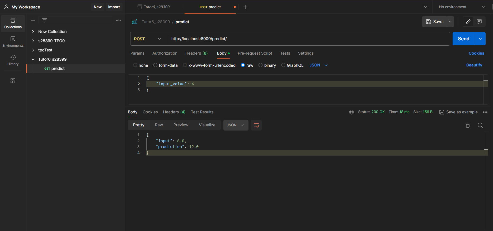
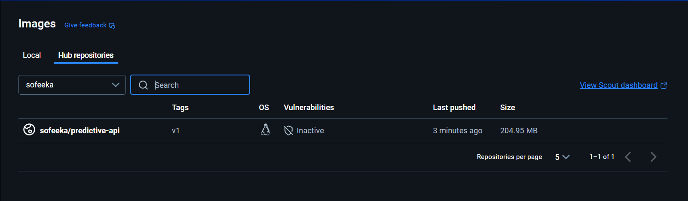
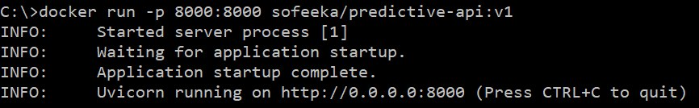
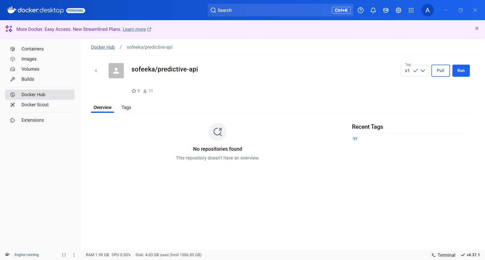
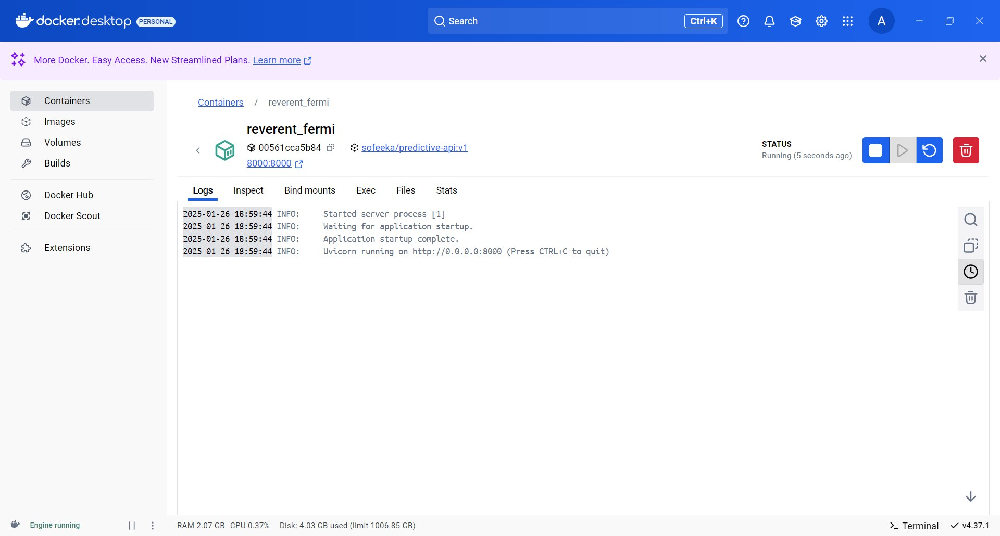
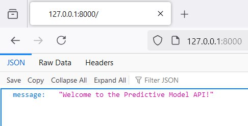

# Tutor6

---

### This README file shows successfull completion of task "Create and Publish a Dockerized API with a Predictive Model"

#### Objectives:
1. Develop a simple API application that uses a predictive model.
2. Dockerize the application and run it locally.
3. Push the Docker image to DockerHub for public use.

---
### The API was tested with Postman:

---
### The image is available on DockerHub:

---
### Public usage by my friend:

