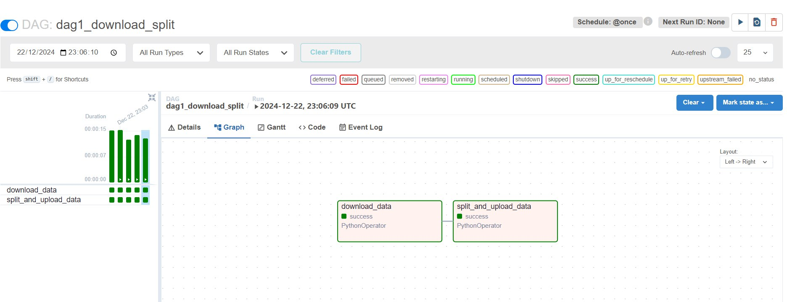

#### This README file is a designed and visualised Architecture of predictions of hotel booking cancelletions based on Kaggle's public `Hotel Booking Demand` dataset. 
#### UPD: with supporting DAGs
##### It includes necessary diagrams and short descriptions to provide clarity.
### 1. DAGs
##### DAG1

##### DAG2

### 2. Components 
- **API**: Getting Model Predictions
- **Random Forest Classifier AI Model**: Predict if a booking will be cancelled
- **Raw dataset**: Kaggle public `Hotel Booking Demand` dataset
- **Cloud database**: `Files.io` MySQL Cloud Database for storing the clean dataset
### 3. Data Flow
##### Diagram

##### Description
- Initially the raw dataset is loaded from Kaggle Public Datasets.
- In data preparation step data is cleaned, normalized and standartized. 
- After cleaning clean data is saved to the `Filess.io` MySQL database. 
- The data from the cloud database is used for model training.
- The trained model is then saved and stored in `.h5` file.
- Predictions are possible through API.
### 4. System Architecture Design 
##### Diagram

##### Description
- Initially a raw dataset is loaded from Kaggle Public Datasets.
- The data in a form of pandas Dataframe is prepared to training using `prepare_data.py`.
- Prepared clean data is in a form of a Dataframe too.
- Clean data is then saved to the `Filess.io` MySQL database.
- Clean data from the cloud database is used for training the model using `train_model.py`.
- The trained model is then saved and stored locally in `.h5` file.
- Prediction requests can be made through the API and using `predict.py`.